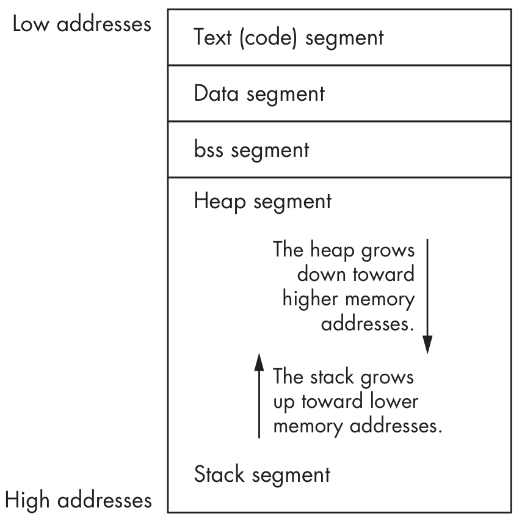

# Assembly

## Basics

Main references: [HTB Intro to Assembly Language](https://academy.hackthebox.com/course/preview/intro-to-assembly-language) and [The Art of Exploitation](https://en.wikipedia.org/wiki/Hacking:_The_Art_of_Exploitation).

Assemble code:
```bash
nasm -f elf64 helloWorld.s
```

Link code (with libc functions):
```bash
ld -o fib fib.o --dynamic-linker /lib64/ld-linux-x86-64.so.2
```

Disassemble:
```bash
objdump -M intel -d helloWorld  # .text section
objdump -sj .data helloWorld    # .data section
```

## Registers

| Register Description          |  64-bit | 32-bit | 16-bit | 8-bit |
| ----------------------------- | ------- | ------ | ------ | ----- |
| **Data/Arguments Registers**  |
| Syscall Number/Return value   | rax     | eax    | ax     | al
| Callee Saved                  | rbx     | ebx    | bx     | bl
| 1st arg - Destination operand | rdi     | edi    | di     | dil
| 2nd arg - Source operand      | rsi     | esi    | si     | sil
| 3rd arg                       | rdx     | edx    | dx     | dl
| 4th arg - Loop counter        | rcx     | ecx    | cx     | cl
| 5th arg                       | r8      | r8d    | r8w    | r8b
| 6th arg                       | r9      | r9d    | r9w    | r9b
| **Pointer Registers**         |
| Base Stack Pointer            | rbp     | ebp    | bp     | bpl
| Current/Top Stack Pointer     | rsp     | esp    | sp     | spl
| Instruction Pointer           | rip     | eip    | ip     | ipl

## Assembly instructions


| Instruction                             | Description                                                                               | Example
| --------------------------------------- | ----------------------------------------------------------------------------------------- | -------
| **Data**                                |                                                                                           |
| `mov`                                   | Move data or load immediate data                                                          | `mov rax, 1 ; rax = 1`
| `lea`                                   | Load an address pointing to the value                                                     | `lea rax, [rsp+5] ; rax = rsp+5`
| `xchg`                                  | Swap data between two registers or addresses                                              | `xchg rax, rbx`
| **Unary**                               |                                                                                           |
| `inc`                                   | Increment by 1                                                                            | `inc rax`
| `dec`                                   | Decrement by 1                                                                            | `dec rax`
| **Binary**                              |                                                                                           |
| `add`                                   | Add both operands                                                                         | `add rax, rbx  ; rax = rax + rbx`
| `sub`                                   | Subtract Source from Destination                                                          | `sub rax, rbx  ; rax = rax - rbx`
| `imul`                                  | Multiply both operands                                                                    | `imul rax, rbx ; rax = rax * rbx`
| **Bitwise**                             |                                                                                           |
| `not`                                   | Bitwise NOT                                                                               | `not rax`
| `and`                                   | Bitwise AND                                                                               | `and rax, rbx`
| `or`                                    | Bitwise OR                                                                                | `or rax, rbx`
| `xor`                                   | Bitwise XOR                                                                               | `xor rax, rbx`
| **Loops**                               |                                                                                           |
|                                         | Sets loop (rcx) counter to x                                                              | `mov rcx, 3`
| `loop`                                  | Jumps back to the start of loop until counter reaches 0                                   | `loop exampleLoop`
| **Branching**                           |                                                                                           |
| `jmp`                                   | Jumps to specified label, address, or location                                            | `jmp loop`
| `jz`                                    | Destination equal to Zero                                                                 | `; D = 0`
| `jnz`                                   | Destination Not equal to Zero                                                             | `; D != 0`
| `js`                                    | Destination is Negative                                                                   | `; D < 0`
| `jns`                                   | Destination is Not Negative (i.e. 0 or positive)                                          | `; D >= 0`
| `jg`                                    | Destination Greater than Source                                                           | `; D > S`
| `jge`                                   | Destination Greater than or Equal Source                                                  | `; D >= S`
| `jl`                                    | Destination Less than Source                                                              | `; D < S`
| `jle`                                   | Destination Less than or Equal Source                                                     | `; D <= S`
| `cmp`                                   | Sets RFLAGS by evaluating (first - second)                                                | `cmp rax, rbx`
| **Stack**                               |                                                                                           |
| `push`                                  | Copies the specified register/address to the top of the stack                             | `push rax`
| `pop`                                   | Moves the item at the top of the stack to the specified register/address                  | `pop rax`
| **Functions**                           |                                                                                           |
| `call`                                  | push the next instruction pointer rip to the stack, then jumps to the specified procedure | `call printMessage`
| `ret`                                   | pop the address at rsp into rip, then jump to it                                          | `ret`


## The Stack

Remember that a program receives its Virtual Memory and it has the following segments of memory:



The stack is a segment of memory allocated for the functions and their dynamic variables. It has a Last-in First-out (LIFO) data structure, which means that we push data into the stack, and only can pop the last element pushed.

The `$rsp` register always points to the top of the stack. This means that once we pop an element, it will pop the value that `$rsp` was pointing to, and then `$rsp` will be added because we free the memory just popped. On the other hand, when we push an element, the value of `$rsp` will subtracted because we need to allocate memory to the stack.

| Instruction                             | Description                                                                               | Example
| --------------------------------------- | ----------------------------------------------------------------------------------------- | -------
| push                                    | Copies the specified register/address to the top of the stack 	                          | push rax
| pop                                     | Moves the item at the top of the stack to the specified register/address 	              | pop rax

To save our registers `rax` and `rbx` to use a function, we push them into the stack and, after the function call, we pop them in reverse order.
```asm
global  _start

section .text
_start:
    xor rax, rax    ; initialize rax to 0
    xor rbx, rbx    ; initialize rbx to 0
    inc rbx         ; increment rbx to 1
    push rax        ; push registers to stack
    push rbx
    ; call function
    pop rbx         ; restore registers from stack
    pop rax
...SNIP...
```


## Syscalls

A syscall is like a globally available function that the Operating System Kernel provides to us. The available syscalls can be found in files like `unistd_64.h`. If we want info on a syscall, we can issue the command `man 2 write` for example on the `write` syscall.

To call a syscall, we have to:

1. Save registers to stack

2. Set its syscall number in rax

3. Set its arguments in the registers

4. Use the syscall assembly instruction to call it

The convention on which registers to use for a syscall is on the following table:

| Instruction                             | Description
| --------------------------------------- | -----------------------------------------------------------------------------------------
| Description                             | 64-bit Register
| Syscall Number/Return value             | rax
| Callee Saved                            | rbx
| 1st arg                                 | rdi
| 2nd arg                                 | rsi
| 3rd arg                                 | rdx
| 4th arg                                 | rcx
| 5th arg                                 | r8
| 6th arg                                 | r9

We have a register for the first 6 arguments. Any additional argument can be stored in the stack (though not many syscall use more than 6).

Going back to the `write` syscall, we should pass `fd`, `pointer`and `length`.
```asm
global  _start

section .data
    message db "Fibonacci Sequence:", 0x0a  ; 0x0a is the '\n'

section .text
_start:
    mov rax, 1       ; rax: syscall number 1 (write)
    mov rdi, 1       ; rdi: fd 1 for stdout (0 - stdin, 1 - stdout, 2 - stderr)
    mov rsi,message  ; rsi: pointer to message
    mov rdx, 20      ; rdx: print length of 20 bytes
    syscall
...SNIP...
```

Whenever our program finishes executing, it exits with a segmentation fault. This is because we are ending our program abruptly, without going through the proper procedure of exiting programs in Linux, by calling the `exit syscall` and passing an exit code.

Our `exit syscall` should be as follows for normal execution:
```asm
    mov rax, 60
    mov rdi, 0      ; return 0: no error
    syscall
```
<++>
