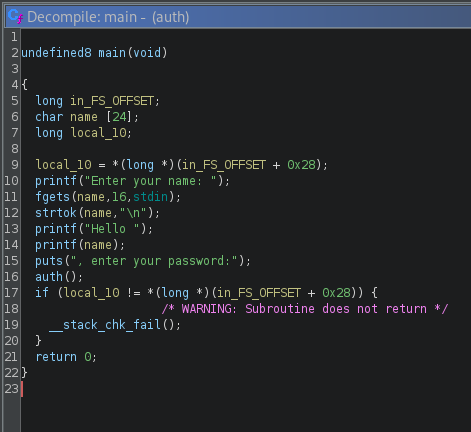

### crackme id: 5e8349b033c5d4439bb2e040
### BEST VIEWED THRU VSCODE OR OTHER MARKDOWN READER

# The thought process

The crackme listing states the ALSR needs to be on - I checked whether it's enabled on my system, just in case (it should be on by default):


This means it's on.

I then followed by executing the crackme:


Well, it was worth a try. 

I then looked at what Ghidra was able to come up with, to (hopefully) get a high-level understanding of the code quickly:



This is mostly in line with how the program behaved after being executed. The important thing to notice here is that `printf()` is being used to directly print out a user-provided value (no `%s` or nothing) - this can be a potential venue to explore later.

The main (hah) fun seems to take place in `auth()`, so I took a look at it too:


Okay, so the program:
1. reserves 64 bytes of memory for a char, 
2. stores the pointer to the `normal()` function at offset 104 of the pointer to the allocated char - that is to say, it stores it 40 bytes after the end of the allocated region on the heap,
3. asks the user for a password, which is saved at `ptr`,
4. executes (jumps to) whatever is at the offset 104 from the base of `ptr`.

The most important takeaway here is that even thought the buffer for user input is only 64 bytes long, the `fgets()` function limits the user input to 1000 characters - therefore we can overwrite the `normal()` function pointer stored at offset 104.

Looking at the disassembly, there is another function that's in use (though it's not called directly anywhere), namely `authenticated()` (I used `radare2` here, but it's just as apparent in the Ghidra disassembly and symbol table):


The important thing to note here is that this function lives 0x62 bytes away from `main()`.

Let's dive a bit deeper and look at the disassembly of the `auth()` function - I used `gdb`:


Just for funsies, I set a breakpoint at that offset to swap the value in `rdx` for a pointer to `authenticated()`:


Now it's only a matter of getting the base address for the `authenticated()` function and inserting it into `rdx`:


Well, this method alone certainly can't pass as a solution, so let's keep digging.

Even though the base address of the program changes upon execution, the **relative distances between instructions remain the same** - that is to say, if we can somehow reliably get the address of some function in the program, we can easily calculate the address of `authenticated()`, with which we can overwrite the pointer to `normal()`.

Remember the `printf()` call that directly prints out the user-submitted string? How about filling it with `%p`'s or other string formatting symbols to fool it into thinking it has arguments to print out (more succinctly known as a [format string attack](https://en.wikipedia.org/wiki/Uncontrolled_format_string))?

This will allow us to peek into places where the arguments would be stored (which varies based on the calling convention, the type of the arguments and some other things). To test this out, I set a breakpoint just before the call to `printf()`:


The origin of the exact values being printed here adheres to the [SystemV calling convention](https://en.wikipedia.org/wiki/X86_calling_conventions#System_V_AMD64_ABI), which for integer/pointer type arguments would be:
1. `rdi` - here it stores the 1st argument (or rather a stack pointer), which would be the format string itself
2. `rsi` - this is the pointer to `argv`, since `rsi` also stores a 2nd argument to `main()`
3. `rdx` - as seen in the listing, its value is 0 (nil in %p formatting)
4. `rcx` - the same as `rdx`
5. `r8`
6. `r9`
7. and more = the stack

The only piece of the puzzle left is one trick in C string formatting - `%n$x` allows us to print n-th given argument as hex ([wikipedia link](https://en.wikipedia.org/wiki/Printf#Parameter_field)). It's important to remember though that n in here is not the n-th argument that's passed to `printf()`, but rather n+1th - so `%5$p` will print out the contents of `r9`, not `r8`.

Let's examine the contents of the stack first (x86 is little-endian, hence the memory being read right-to-left):


Given how we're searching the stack and looking for an address to a function it would be sensible to search for a return address (the one that is pushed on the stack when the CALL instruction is executed).
Since we can only proceed down the stack here and `printf()` is located in `main()`, we should be able to locate the return address of `main()` (that was being pushed there by `_libc_start_main()`).

And here it is, as the 15th "argument":


Now that we have a reliable method of getting the address of `main()`, we can use it to calculate the address of `authenticated()` and overwrite the pointer to `normal()` while typing in the password.
Therefore, the solution would look something akin to this (I used `pwntools` since I didn't really feel like coding this in Bash or using subprocess in Python, but do take note that if the program was debug-aware this could not work):

```python
import pwn

proc = pwn.process("./auth", level="error")

proc.sendline(b"%15$p")
# get the main address from the response and convert it to hex
main_addr = proc.recvline().split()[4][:-1]
main_addr = int(main_addr, 16)
# calculate the offset to authenticated()
authenticated_addr = main_addr - 0x62
# write 104 of any char and then the pointer to authenticated()
proc.sendline(b"1" * 104 + pwn.util.packing.p64(authenticated_addr))
print(proc.recvline())

proc.close()
```

Which yields:


I attached this script as a file in the archive (`keygen.py`).